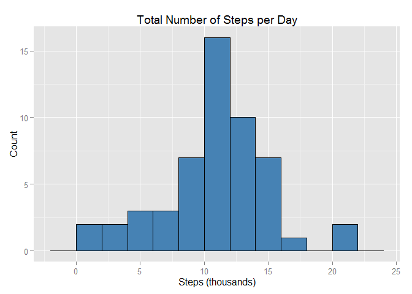
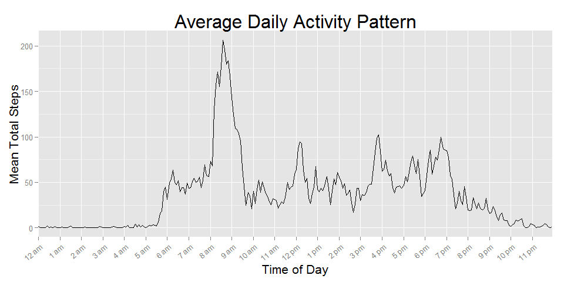
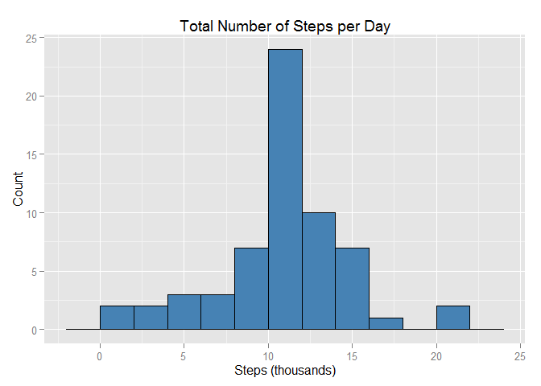
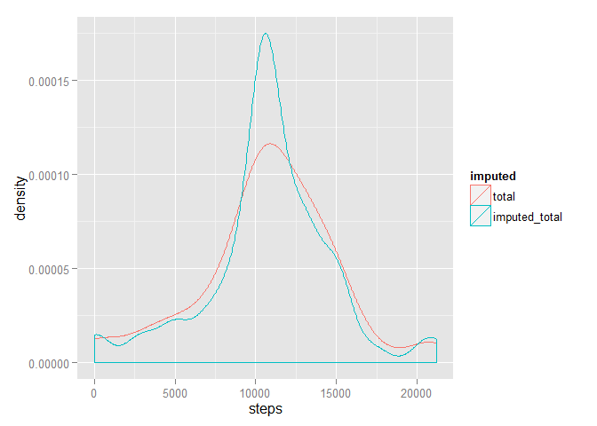
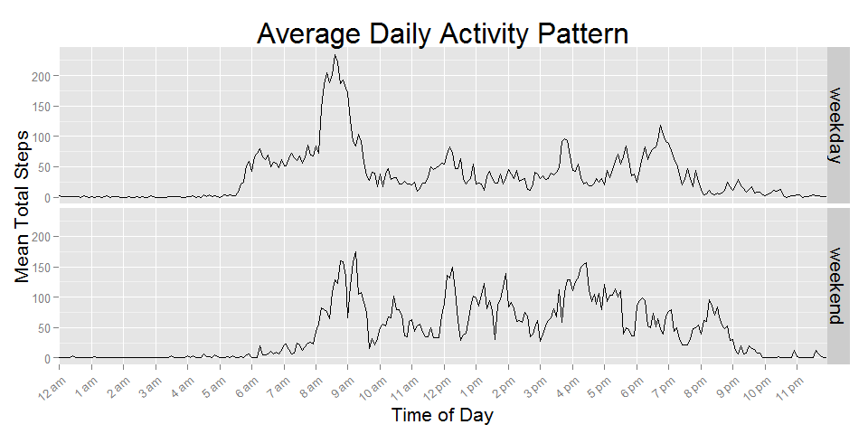

# Reproducible Research: Peer Assessment 1
Keith G. Williams  
Load Packages

```r
library(lubridate)
library(dplyr)
library(ggplot2)
library(tidyr)
```
## Loading and preprocessing the data

```r
# read data
data <- read.csv("activity.csv", colClasses = c("integer", 
                                                "character", 
                                                "integer"))
# convert date to posixlt
data$date <- ymd(data$date)

# convert intervals into minutes for plotting time series
data$interval <- data$interval %/% 100 * 60 + data$interval %% 100
```

## What is mean total number of steps taken per day?

Summarize the total number of steps by day and plot a histogram.

```r
# summarise total steps by date
by_day <- data %>% 
    group_by(date) %>% 
    summarise(total = sum(steps))

# plot
ggplot(by_day, aes(total / 1000)) + 
    geom_bar(binwidth=2, fill="steelblue", col="black") + 
    labs(x="Steps (thousands)", y="Count") + 
    ggtitle("Total Number of Steps per Day")
```

 

Mean and Median of total steps by day:

```r
mean(by_day$total, na.rm=TRUE)
```

```
## [1] 10766.19
```

```r
median(by_day$total, na.rm=TRUE)
```

```
## [1] 10765
```

## What is the average daily activity pattern?

```r
# summarise average steps by interval
by_interval <- data %>% 
    group_by(interval) %>% 
    summarise(mean=mean(steps, na.rm=TRUE))

# x axis labels
hrs <- c("12 am", "1 am", "2 am", "3 am", "4 am", "5 am", "6 am", "7 am", "8 am", "9 am", "10 am", "11 am", 
         "12 pm", "1 pm", "2 pm", "3 pm", "4 pm", "5 pm", "6 pm", "7 pm", "8 pm", "9 pm", "10 pm", "11 pm")

# plot
ggplot(by_interval, aes(interval, mean)) + 
    geom_line() + 
    scale_x_discrete(breaks=seq(0, 1380, by=60), labels=hrs) + 
    labs(x="Time of Day", y="Mean Total Steps") + 
    ggtitle("Average Daily Activity Pattern") + 
    theme(axis.text.x = element_text(angle = 40, hjust = 1), 
          axis.title.x = element_text(size = 16), 
          axis.title.y = element_text(size = 16), 
          title = element_text(size = 20))
```

 

5-minute interval with maximum average number of steps:

```r
by_interval %>% 
    filter(mean == max(mean)) %>% 
    mutate(interval = interval %/% 60 * 100 + interval %% 60)
```

```
## Source: local data frame [1 x 2]
## 
##   interval     mean
## 1      835 206.1698
```

## Imputing missing values
Total and proportion of rows with missing values:

```r
sum(is.na(data$steps))
```

```
## [1] 2304
```

```r
mean(is.na(data$steps))
```

```
## [1] 0.1311475
```

Impute missing values with the mean number of steps across all days for a given interval.

```r
imputed <- data %>% 
    group_by(interval) %>% 
    mutate(steps = ifelse(is.na(steps), 
                          as.integer(mean(steps, na.rm=TRUE)), 
                          steps))
```

Plot a new histogram of total steps by day with imputed data.

```r
# summarize imputed data, total steps by day
imputed_by_day <- imputed %>% 
    group_by(date) %>% 
    summarise(imputed_total = sum(steps))

# plot
ggplot(imputed_by_day, aes(imputed_total / 1000)) + 
    geom_bar(binwidth=2, fill="steelblue", col="black") + 
    labs(x="Steps (thousands)", y="Count") + 
    ggtitle("Total Number of Steps per Day")
```

 

Mean and median of total steps by day with imputed values:

```r
mu <- mean(imputed_by_day$imputed_total, na.rm=TRUE)
difference_in_means <- mu - mean(by_day$total, na.rm=TRUE)
# print imputed average and difference from original mean
c(mu, difference_in_means)
```

```
## [1] 10749.77049   -16.41819
```

```r
med <- median(imputed_by_day$imputed_total, na.rm=TRUE)
difference_in_medians <- med - median(by_day$total, na.rm=TRUE)
# print imputed median and difference from original median
c(med, difference_in_medians)
```

```
## [1] 10641  -124
```

Compare imputed results to original results in which NAs were ignored:

```r
# merge original and imputed data for comparison
compare <- left_join(by_day, imputed_by_day) %>%
    gather(imputed, steps, 2:3)
```

```
## Joining by: "date"
```

```r
# plot
ggplot(compare, aes(steps, color=imputed)) + geom_density()
```

```
## Warning: Removed 8 rows containing non-finite values (stat_density).
```

 

From the above plot, one can see that the mean and median are only slightly shifted to the left, but the variance for the imputed data set is much lower.  This difference is sensitive to the strategy for imputing missing values.  Since the mean by interval was used, it follows that the imputed data is more concentrated about the mean.

## Are there differences in activity patterns between weekdays and weekends?

```r
# add weekend distinction variable
data <- data %>% 
    mutate(weekend = ifelse(weekdays(date) %in% c("Saturday", "Sunday"),
                            "weekend", 
                            "weekday"))
data$weekend <- factor(data$weekend)

# summarise average steps by interval by weekend/weekday
weekend_by_interval <- data %>% 
    group_by(weekend, interval) %>% 
    summarise(mean=mean(steps, na.rm=TRUE))

# plot
ggplot(weekend_by_interval, aes(interval, mean)) + 
    geom_line() + 
    facet_grid(weekend~.) +
    scale_x_discrete(breaks=seq(0, 1380, by=60), labels=hrs) + 
    labs(x="Time of Day", y="Mean Total Steps") + 
    ggtitle("Average Daily Activity Pattern") + 
    theme(axis.text.x = element_text(angle = 40, hjust = 1), 
          axis.title.x = element_text(size = 16), 
          axis.title.y = element_text(size = 16),
          strip.text = element_text(size = 16),
          title = element_text(size = 20))
```

 
